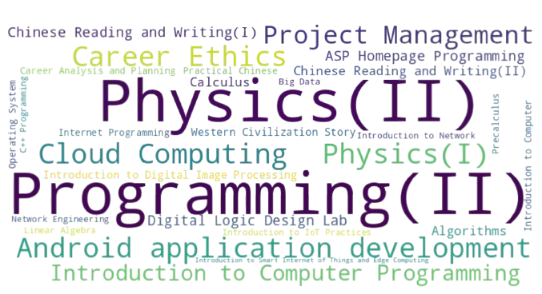

    <table cellspacing="0" cellpadding="0">
        <tr>
            <td width="20%">
                
            </td>
            <td width="80%">
                <h2>👋 Hi there! I'm Yu-Cheng Chang</h2>
                
Welcome to my GitHub profile! I'm a passionate master's student and researcher at the Department of Computer Science and Information Engineering (CSIE), National Taipei University of Technology (NTUT) in Taiwan.

                
My primary focus is cutting-edge technologies that drive innovation and transform industries.

            </td>
        </tr>
    </table>

---

## 🌟 About Me

- 🎓 **Education**: Pursuing a Master's Degree at NTUT CSIE (Fall 2024 Cohort)
- 💻 **Current Roles**:
  - Researcher specializing in **AI**, **IoT**, **ADAS**, **Embedded Systems**, **Sensors Technology**, and **Computer Vision**
  - Part-time lecturer in new technologies, media, and career planning for workplace life
- 📝 **Published Work**: Authored approximately 10 academic papers, most indexed by EI
- 🏆 **Competitions**: Multiple awards in science, technology, and invention
- 🧑🏻‍💻 **Organizations**: [Team-COFE](https://github.com/TEAM-COFE), [EMO-Lab](https://github.com/EMO-Labs)

---

## 🔬 Research Interests

- **Artificial Intelligence (AI)**: Deep Learning, NLP, Machine Learning, Classification Methods, Data Analysis, and Neural Networks
- **Internet of Things (IoT)**: Smart Scheduling, Sensor Networks
- **Advanced Driver-Assistance Systems (ADAS)**: Lane-keeping systems, V2X communication, driver behavior prediction
- **Computer Vision**: Image Recognition, Gesture Detection
- **Embedded Systems**: Platforms including FPGA, Raspberry Pi, ESP32, Arduino
- **Sensors Technology**: Temperature and humidity sensing, image capture, and multi-context measurement and control systems

---

## 🎓 Education

- **Master of Computer Science and Information Engineering**  
  *National Taipei University of Technology (NTUT)*  
  *Sep, 2024 – Current*

- **Bachelor of Computer Information and Network Engineering**  
  *Lunghwa University of Science and Technology*  
  *Sep, 2020 – Jun, 2024*

- **Program in Electrical Engineering**  
  *New Taipei City Tamsui Senior Commercial Vocational School*  
  *Sep, 2017 – Jun, 2020*

---

## 🎓 Teaching Experience

     

---

## 🌏 Let's Connect

|**ResearchGate** | **ORCID** | **Google Scholar** | **IEEE Xplore** | **SCI Profilo** |
| :--------------: | :------: | :----------------: | :-------------: | :-------------: |
| [Link](https://www.researchgate.net/profile/Yu-Cheng-Chang-14) | [Link](https://orcid.org/0000-0003-1301-9192) | [Link](https://scholar.google.com/citations?user=-SWWt7kAAAAJ&hl=zh-TW) | [Link](https://ieeexplore.ieee.org/author/37089901051)  | [Link](https://sciprofiles.com/profile/3276587) |

| Contact         | Link                                                                 |
|------------------|----------------------------------------------------------------------|
| **Website**      | [Link](https://www.yucheng208.net)                                 |
| **Email**        | [Link](mailto:yucheng208@outlook.com)                              |
| **WhatsApp**     | [Link](https://api.whatsapp.com/send/?phone=886975265171&text&type=phone_number&app_absent=0) |
| **Telegram**     | [Link](https://t.me/Ryan_0208)                                     |
| **Twitter**      | [Link](https://twitter.com/YuCheng208)                             |
| **LinkedIn**     | [Link](https://www.linkedin.com/in/yu-cheng-chang/)                |

---

### Feel free to explore my repositories and connect with me for collaborations and discussions or to say hi! 😊

---

## ☕ Buy Me A Coffee!

